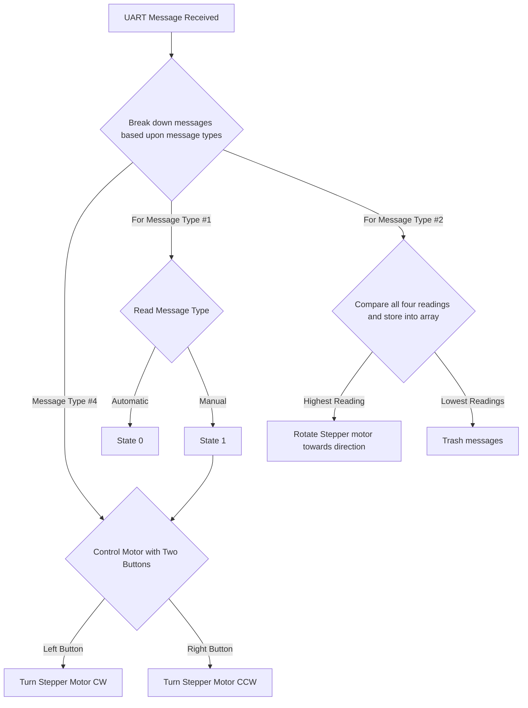

## Team Bytes
| Byte | Function |
|----|-------|
| AZ | Start |
| YB | Stop  |

| Unique ID | Byte |
|-----|-----|
|Shon Ha| H |
|Maximus Mathews|M|
|Rohan Fernandez|F|
|Shelton Larance|L|

## Messages Sent/Broadcasted
### Message Type 3 (Voltage Readings from Solar Panel)

<b><i>Received and Forwarded to MQTT</i></b>

|               | Byte 1         | Byte 2-5        |
|---------------|----------------|-----------------|
| Variable Name | voltage_sensor | voltage_reading |
| Variable Type | char           | uint16_t           |
| Min Value     | V              | 0000           |
| Max Value     | V              | 5400           |
| Example       | V              | 2572           |

## Messages Received
### Message Type 1 (Wifi Toggle - Auto/Manual)

<b><i>Used to toggle stepper motor functionality from automatic (state 0) to manual (state 1).</i></b>

|               | Byte 1      | Byte 2 |
|---------------|-------------|--------|
| Variable Name | mode | mode_toggle |  
| Variable Type | char    |  uint8_t| 
| Min Value     | M           |   0|
| Max Value     | M           |   1|
| Example       | M           |   1|

### Message Type 2 (Optical Sensor Readings)

<b><i>Used to determine where the stepper motor will rotate, facing the solar panel towards the highest light level detected by the optical sensors. Bytes 1-2 act as an identifier, allowing the stepper motor to determine which way to face once all four readings have been sent.</i></b>

|               | Byte 1-2   | Byte 3-6   | Byte 7-8   | Byte 9-12  | Byte 13-14   | Byte 15-18 | Byte 19-20  | Byte 21-24 |
|---------------|------------|------------|------------|------------|--------------|------------|-------------|------------|
| Variable Name | sensor_one | L1_Reading | sensor_two | L2_Reading | sensor_three | L3_Reading | sensor_four | L4_Reading |
| Variable Type | char       | uint16_t      | char       | uint16_t      | char         | uint16_t      | char        | uint16_t      |
| Min Value     | S1         | 0000          | S2         | 0000          | S3           | 0000          | S4          | 0000          |
| Max Value     | S1         | 9999       | S2         | 9999       | S3           | 9999       | S4          | 9999       |
| Example       | S1         | 3567       | S2         | 2343       | S3           | 1232       | S4          | 2142       |

### Message Type 4 (Button - digital signal)

<b><i>Used to manually control stepper motors from left to right. It has two states (0) and (1) to determine if the button has been pressed.</i></b>

|               | Byte 1      | Byte 2       | Byte 3 | Byte 4 |
|---------------|-------------|--------------|--------|--------|
| Variable Name | left_button | button_left_toggle |right_buttom| button_right_toggle|
| Variable Type | char     | uint8_t      | char| uint8_t
| Min Value     | L           | 0            | R|0|
| Max Value     | L           | 1            |R|1|
| Example       | L           | 1            |R|0|

## Message Handling Process Flow
### Messages Received

